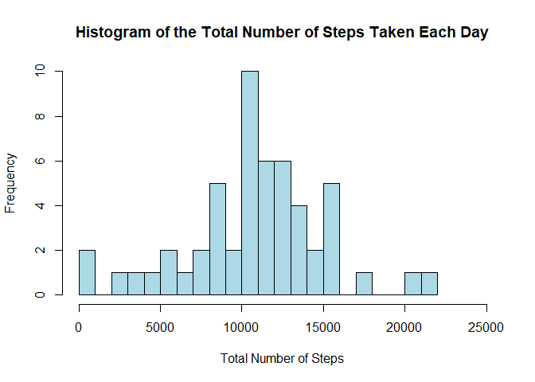
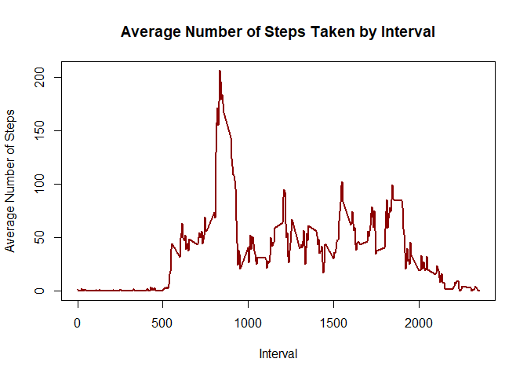
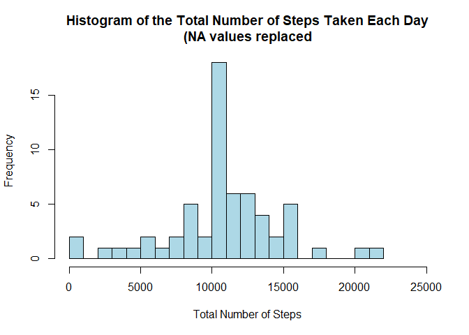
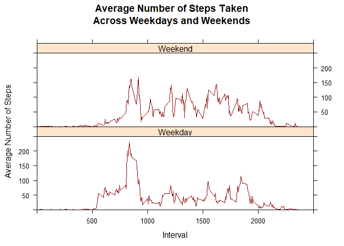

# Reproducible Research: Week 2 Project
Lee Wittschen  
October 29, 2017  


## Introduction

The purpose of this assignment is to complete  various analyses of personal activity monitoring data collected between 1 October 2012 and 30 November 2012. The data collected and analyzed is the number of steps taken in five (5) minute intervals throughout the day. This document will include a description and the R code for each step taken as part of this analysis.

## Read in the data and complete data processing:

A cursory review of the data and the analyses required reveals that some data processing of the raw data is required. The first step in the process is to read in the personal activity monitoring data and store it in a dataframe called "Activity.Raw.Data:


```r
Activity.Raw.Data <- read.csv(file = "activity.csv", header=TRUE)
```

## Histogram of the total number of steps taken each day

As the data includes 5 minute intervals for each day, we first aggregate the number of steps for each day:


```r
sum.steps.day <- aggregate(Activity.Raw.Data$steps, by=list(Activity.Raw.Data$date), FUN=sum)
names(sum.steps.day) <- c("date", "total")
head(sum.steps.day)
```

```
##         date total
## 1 2012-10-01    NA
## 2 2012-10-02   126
## 3 2012-10-03 11352
## 4 2012-10-04 12116
## 5 2012-10-05 13294
## 6 2012-10-06 15420
```
*Note - we are ignoring missing (NA) values in the step data for this portion of the analysis*

The next step is to create the histogram of the number of steps taken each day:

```r
hist(sum.steps.day$total, breaks=20, col="lightblue", xlab="Total Number of Steps", xlim=c(0,25000), main="Histogram of the Total Number of Steps Taken Each Day")
```

<!-- -->

## Compute the mean and median number of steps taken each day

The mean and median number of steps taken each data is computed using the aggregate data computed for the histogram above. The mean number of steps taken each day is determined by:

```r
mean(sum.steps.day$total, na.rm=TRUE)
```

```
## [1] 10766.19
```

The median number of steps taken each day is determined by:

```r
median(sum.steps.day$total, na.rm=TRUE)
```

```
## [1] 10765
```
*Note - we need to set na.rm=TRUE to compute the mean and median*

## Average Daily Activity Pattern

In this section we want to make a time series plot of the 5-minute interval and the average number of steps taken, averaged across all days. The first step is to compute the average number of steps taken for each interval across all of the days. This is completed as follows:

```r
mean.steps.interval <- aggregate(Activity.Raw.Data$steps, by=list(Activity.Raw.Data$interval), FUN=mean, na.rm=TRUE)
names(mean.steps.interval) <- c("interval", "mean")
head(mean.steps.interval)
```

```
##   interval      mean
## 1        0 1.7169811
## 2        5 0.3396226
## 3       10 0.1320755
## 4       15 0.1509434
## 5       20 0.0754717
## 6       25 2.0943396
```

Next we create the time series plot of the average number of steps taken by interval:

```r
plot(mean.steps.interval$interval, mean.steps.interval$mean, type="l", col="darkred", lwd=2.5, xlab="Interval", ylab="Average Number of Steps", main="Average Number of Steps Taken by Interval")
```

<!-- -->

Finally, we want to see which 5-minute interval, on average across all days, contains the maximum number of steps. We compute this as follows:


```r
max.avg.steps <- max(mean.steps.interval$mean)
max.avg.steps
```

```
## [1] 206.1698
```

```r
max.steps <- subset(mean.steps.interval, mean==max.avg.steps, select=interval)
max.steps
```

```
##     interval
## 104      835
```
We see that the 104th value in the mean.steps.interval dataframe contains the maximum average number of steps (206.1698113) and the interval (835) in which the maximum occurs. This corresponds to the time series plot so we are confident of our result.

## Imputing Missing Values

In this section we will address the missing values (NA's) in the original dataset.  First, we will see how many missing values there are in the data.  This is computed as follows:


```r
sum(is.na(Activity.Raw.Data$steps))
```

```
## [1] 2304
```
So the number of missing values in the activity data is 2304.

Next we need a strategy to fill in the missing values. Due to the variability in the average numbers of steps per 5-minute interval, we will the average value per 5-minute interval to fill in the missing values. First, let's revisit the activity data by looking at the first few rows of data:

```r
head(Activity.Raw.Data)
```

```
##   steps       date interval
## 1    NA 2012-10-01        0
## 2    NA 2012-10-01        5
## 3    NA 2012-10-01       10
## 4    NA 2012-10-01       15
## 5    NA 2012-10-01       20
## 6    NA 2012-10-01       25
```
We see that the first few rows do have missing data.  

Next we want to replace missing values with the average step value for the corresponding interval. We will use the average number of steps per interval to do this.


```r
Activity.Raw.Data$steps <- ifelse(is.na(Activity.Raw.Data$steps) == TRUE, mean.steps.interval$mean[mean.steps.interval$interval %in% Activity.Raw.Data$interval], Activity.Raw.Data$steps)
```
We now look at the first few rows of this revised data frame:

```r
head(Activity.Raw.Data)
```

```
##       steps       date interval
## 1 1.7169811 2012-10-01        0
## 2 0.3396226 2012-10-01        5
## 3 0.1320755 2012-10-01       10
## 4 0.1509434 2012-10-01       15
## 5 0.0754717 2012-10-01       20
## 6 2.0943396 2012-10-01       25
```
The revised data corresponds to the average number of steps per interval computed earlier.  The next step is to summarize the number of steps per day.

```r
sum.steps.day <- aggregate(Activity.Raw.Data$steps, by=list(Activity.Raw.Data$date), FUN=sum)
names(sum.steps.day) <- c("date", "total")
```
Let's look at the first few records to see that the missing values have in fact been imputed:

```r
head(sum.steps.day)
```

```
##         date    total
## 1 2012-10-01 10766.19
## 2 2012-10-02   126.00
## 3 2012-10-03 11352.00
## 4 2012-10-04 12116.00
## 5 2012-10-05 13294.00
## 6 2012-10-06 15420.00
```
And we can see that the values inserted in place of the missing values do correspond to the average number steps per interval.

The next step is to create the histogram:

```r
hist(sum.steps.day$total, breaks=20, col="lightblue", xlab="Total Number of Steps", xlim=c(0,25000), main="Histogram of the Total Number of Steps Taken Each Day\n(NA values replaced")
```

<!-- -->

The mean number of steps taken each day, using the imputed data, is determined by:

```r
mean(sum.steps.day$total, na.rm=TRUE)
```

```
## [1] 10766.19
```
The median number of steps taken each day, using the imputed data, is determined by:

```r
median(sum.steps.day$total, na.rm=TRUE)
```

```
## [1] 10766.19
```
The mean and median values for the imputed data are roughly the same as the mean and median for the non-imputed data.  Since we replaced the missing values with the average number of steps for each interval, we expect that the mean and median values would not vary.

## Difference in Activity Patterns Between Weekdays and Weekends

In order to evaluate the difference in activity pattern between weekdays and weekends, we will need to identify the days of the week as well as a designation of weekdays and weekends. We will create a new factor variable with two levels - "weekday" and "weekend". The follow R code chunk will create this variable. This will be completed by first setting the class of the 'date' field to DATE and then using the weekdays() function to identify the weekday and finally set the day.type to either "weekday" or "weekend".

```r
Activity.Raw.Data$date <- as.Date(Activity.Raw.Data$date)
Activity.Raw.Data$weekday <- weekdays(Activity.Raw.Data$date)
Activity.Raw.Data$day.type <- ifelse(Activity.Raw.Data$weekday=="Saturday" | Activity.Raw.Data$weekday=="Sunday", "Weekend", "Weekday")
```
Now we will look at the values of the new variables to validate the results:

```r
table(Activity.Raw.Data$weekday, Activity.Raw.Data$day.type)
```

```
##            
##             Weekday Weekend
##   Friday       2592       0
##   Monday       2592       0
##   Saturday        0    2304
##   Sunday          0    2304
##   Thursday     2592       0
##   Tuesday      2592       0
##   Wednesday    2592       0
```
This shows us that the variables appear to have been assigned correctly.

```r
head(Activity.Raw.Data)
```

```
##       steps       date interval weekday day.type
## 1 1.7169811 2012-10-01        0  Monday  Weekday
## 2 0.3396226 2012-10-01        5  Monday  Weekday
## 3 0.1320755 2012-10-01       10  Monday  Weekday
## 4 0.1509434 2012-10-01       15  Monday  Weekday
## 5 0.0754717 2012-10-01       20  Monday  Weekday
## 6 2.0943396 2012-10-01       25  Monday  Weekday
```

### Time Series Plot
In this section we want to make a time series plot of the 5-minute interval and the average number of steps taken, averaged across all days. The first step is to compute the average number of steps taken for each interval across all of the days. This is completed as follows:

```r
mean.steps.interval <- aggregate(Activity.Raw.Data$steps, by=list(Activity.Raw.Data$day.type, Activity.Raw.Data$interval), FUN=mean, na.rm=TRUE)
names(mean.steps.interval) <- c("day.type", "interval", "mean")
head(mean.steps.interval)
```

```
##   day.type interval       mean
## 1  Weekday        0 2.25115304
## 2  Weekend        0 0.21462264
## 3  Weekday        5 0.44528302
## 4  Weekend        5 0.04245283
## 5  Weekday       10 0.17316562
## 6  Weekend       10 0.01650943
```

Next we create the time series plot of the average number of steps taken, averaged across all weekdays and weekends by interval:

```r
library(lattice)
xyplot(mean ~ interval | day.type, mean.steps.interval, type="l", col="darkred", lwd=1.5, xlab="Interval", ylab="Average Number of Steps", main="Average Number of Steps Taken\nAcross Weekdays and Weekends", layout=c(1,2), xlim=c(0,2500), ylim=c(0,250))
```

<!-- -->


